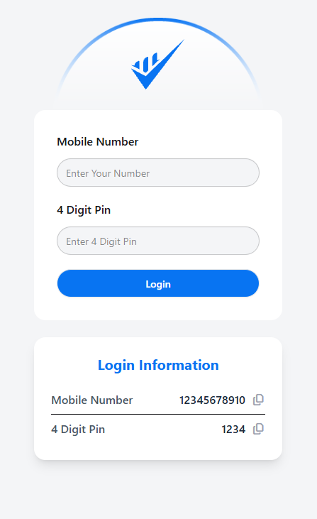
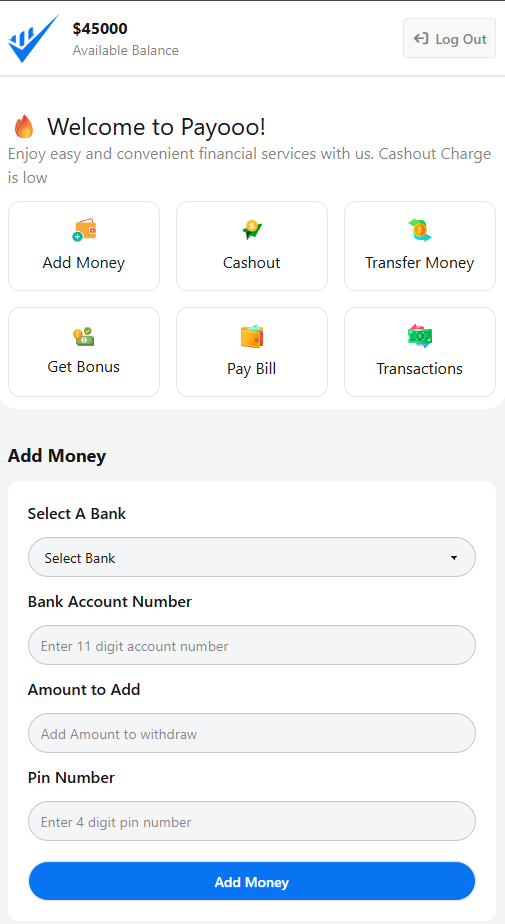
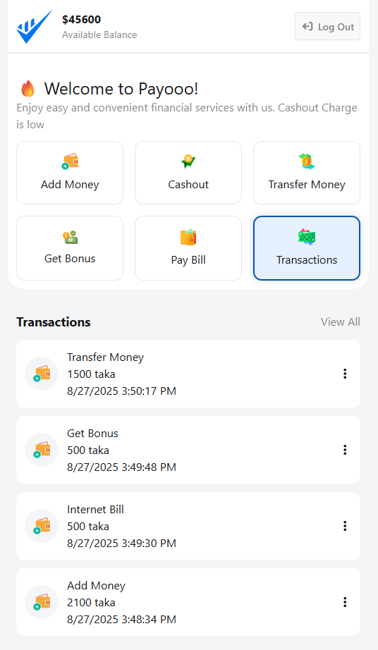

# Payooo – Personal Finance Web Application


---

## Table of Contents
- [Project Overview](#project-overview)  
- [Key Features](#key-features)  
- [Dashboard Cards](#dashboard-cards)  
- [Technologies Used](#technologies-used)  
- [Screenshots](#screenshots)  
- [Installation](#installation)  
- [Usage Instructions](#usage-instructions)  
- [Project Structure](#project-structure)  
- [Future Enhancements](#future-enhancements)  
- [License](#license)  

---

## Project Overview
**Payooo** is a modern, interactive **personal finance web application** for managing money conveniently.  

Users can **login, add money, cash out, transfer funds, pay bills, claim bonuses, and view transactions**. The app features dynamic UI elements, interactive forms, real-time alerts, and transaction history.  

It demonstrates **frontend development skills using HTML, CSS (Tailwind & DaisyUI), and JavaScript**, with **dynamic login info cards, clipboard copy, and responsive design** for professional portfolio presentation.

---

## Key Features
- **Login Page:**  
  - Mobile number and 4-digit PIN login simulation.  
  - Dynamic login info card for demonstration.  
  - Clipboard copy for mobile number and PIN using **FontAwesome icons**.

- **Dynamic Alerts:**  
  - Error and success messages appear below forms for 3 seconds.  
  - Alerts for invalid PIN, invalid account number, insufficient balance, or successful transactions.

- **Responsive Dashboard:**  
  - Grid-based cards for easy navigation.  
  - Hover and active states for better UI feedback.  

---

## Dashboard Cards

| Card | Description | Required Inputs |
|------|-------------|----------------|
| **Add Money** | Add funds to your account. | Bank, Account Number, Amount, PIN |
| **Cash Out** | Withdraw funds from your account. | Agent Number, Amount, PIN |
| **Transfer Money** | Send money to another account. | User Account Number, Amount, PIN |
| **Pay Bill** | Pay utility bills (electricity, water, gas, internet). | Biller Account Number, Amount, PIN |
| **Get Bonus** | Claim bonus using coupon codes. | Coupon Code (e.g., SUMMER, WINTER) |
| **Transactions** | View all past transactions dynamically. | No input needed |

**Dynamic Behavior:**  
- Login info card appears only for forms requiring **account number and PIN**.  
- Alerts show success or error messages dynamically.  
- Transaction history updates automatically after any operation.  
- Clipboard icon allows copying mobile number or PIN quickly.

---

## Technologies Used
- **HTML5 & CSS3** – Structure and styling.  
- **Tailwind CSS & DaisyUI** – Utility-first styling and UI components.  
- **JavaScript (Vanilla JS)** – Form validation, dynamic alerts, transactions, login simulation.  
- **FontAwesome** – Icons for clipboard and UI elements.  
- **Responsive UI/UX:** Card-based layout with hover and active effects.

---

## Screenshots
**Login Page:**  
  
*Dynamic login info card with clipboard copy feature.*

**Home Page / Dashboard:**  
  
*All dashboard cards for Add Money, Cash Out, Transfer, Pay Bill, Bonus, and Transactions.*

**Dynamic Alerts:**  
  
 
*Success and error alerts below forms.*

**Bonus Coupons:**  
  
*Available coupons displayed dynamically below the Bonus form.*

**Transaction History:**  
  
*Past transactions shown dynamically.*

---

## Installation
1. Clone the repository:  
```bash
git clone https://github.com/MD-ELIUS/payoo-mobile-app.git
