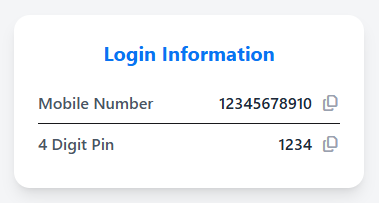

# Payooo - Personal Finance Web App


## Table of Contents
- [Project Overview](#project-overview)
- [Features](#features)
- [Technologies Used](#technologies-used)
- [Screenshots](#screenshots)
- [Installation](#installation)
- [Usage](#usage)
- [Project Structure](#project-structure)
- [License](#license)

---

## Project Overview
**Payooo** is a simple and interactive personal finance web application designed for managing money conveniently. Users can add money, cash out, transfer funds, pay bills, and claim bonuses using coupon codes.  

This project demonstrates **frontend development skills using HTML, CSS (Tailwind & DaisyUI), JavaScript**, and dynamic UI/UX for interactive forms. It is built for **portfolio purposes** to showcase professional web development skills.

---

## Features
- **User Authentication Simulation:** Login using mobile number and PIN (local authentication).
- **Add Money:** Add balance to the account with account number and PIN verification.
- **Cash Out:** Withdraw funds with PIN and account verification.
- **Transfer Money:** Transfer funds between accounts securely.
- **Pay Bills:** Pay utility bills with account number and PIN verification.
- **Get Bonus:** Claim bonus using coupon codes (e.g., SUMMER, WINTER).
- **Transaction History:** View all past transactions dynamically.
- **Dynamic Login Info Card:** Display mobile number and PIN for verification-enabled forms only.
- **Clipboard Copy:** Copy mobile number and PIN easily using FontAwesome icons.
- **Responsive Design:** Works well on desktop and mobile devices.

---

## Technologies Used
- **Frontend:** HTML5, CSS3
- **CSS Frameworks:** Tailwind CSS, DaisyUI
- **Icons:** FontAwesome
- **JavaScript:** Vanilla JS for dynamic interactions
- **Design:** Modern card-based UI for forms and information display

---

## Screenshots

*Home page with cards for Add Money, Cash Out, Transfer, Pay Bill, Bonus, and Transactions.*


*Login Information card dynamically appears for forms requiring account number and PIN.*


*Bonus coupon display for SUMMER and WINTER.*

---

## Installation
1. Clone the repository:
   ```bash
   git clone https://github.com/yourusername/payooo.git
